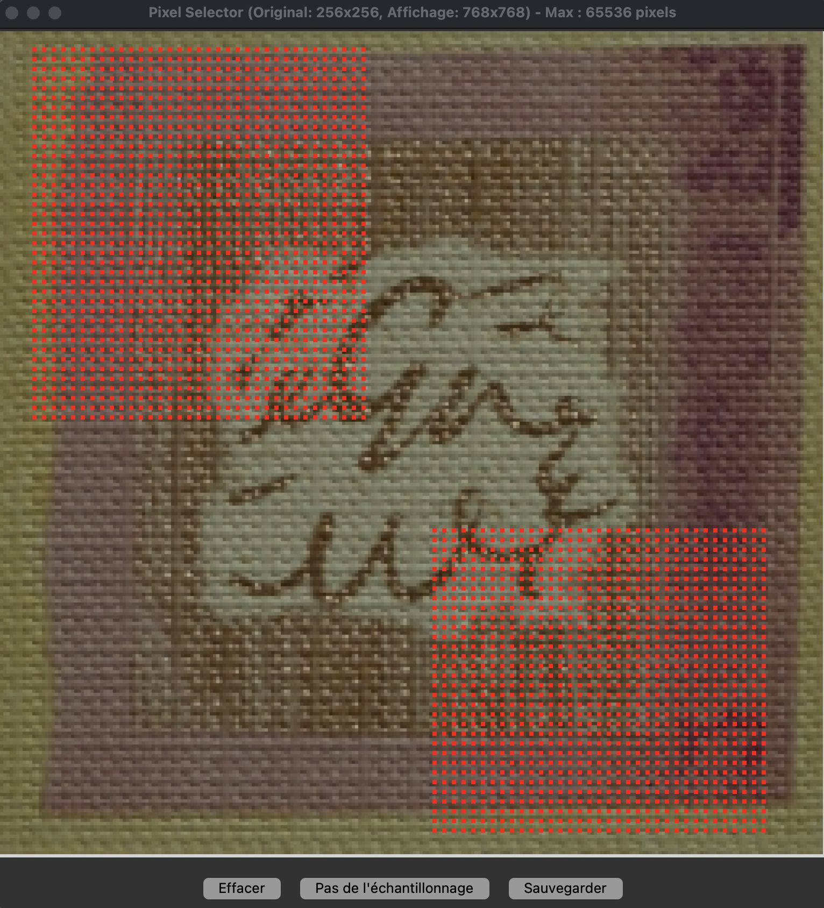
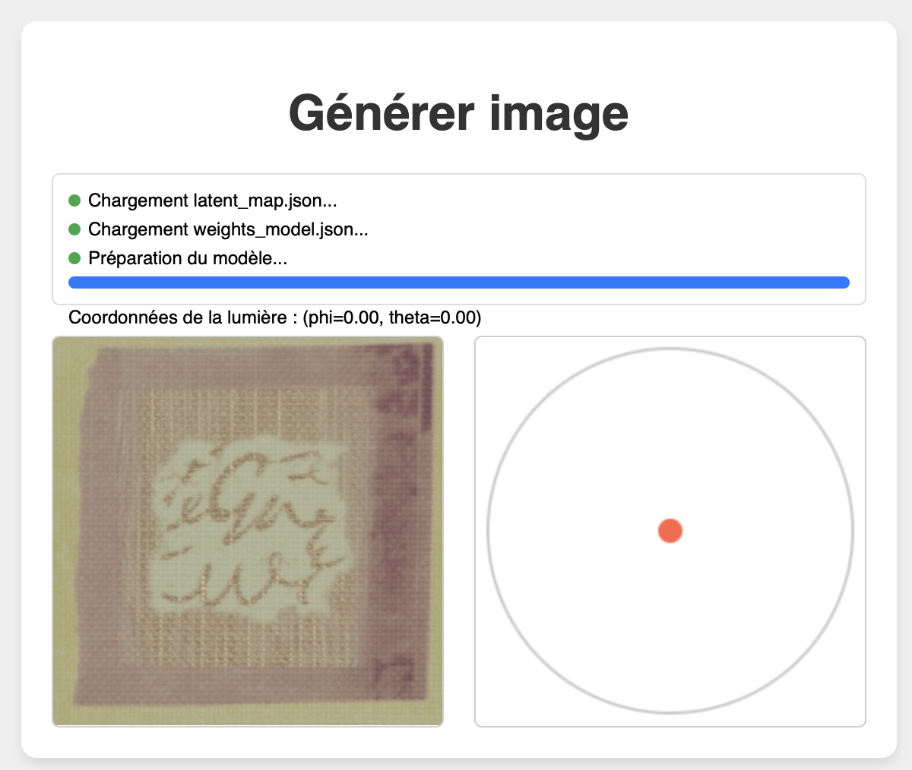

# Neural BTF Compression

Bidirectional Texture Functions (BTFs) characterize the local appearance of a surface under varying viewing and lighting directions. 
These datasets can be extremely memory-intensive due to their high dimensionality.
During this project, I investigated encoder-decoder architectures capable of compressing BTF data into a lower-dimensional latent space.

Key Contributions:

- Neural Compression enabling users to select regions of interest for targeted compression.
- Interactive Exploration: Developed tools to visualize the latent space after compression.
- Real-Time Generation: Implemented interactive rendering for continuous camera/light pairs.

Interactive Exploration -> https://sebastian.cafe/Neural/index.php

This project were conducted during my intership at Centre Inria de l'Université de Bordeaux, under the supervision of Patrick Reuter (Manao Team)


| Preview | Description |
|---|---|
| <a href="assets/select.png"></a> | **Pixel selection**<br>Use this interface to mark regions of interest (ROIs) the pixels the neural network will train on. |
| <a href="assets/viz.png"></a> | **Latent space visualization**<br>Use this interface to navigate through the neural network’s latent space. In this example, the cluster on the left corresponds to the model’s encoding of the purple inscription along the texture’s right edge. |
| <a href="assets/gen.png"></a> | **Continuous texture generation**<br>Use this interface to generate new images of the texture with different camera viewpoints and lighting conditions. |


# Utilisation des programmes

## select_pixels.py

Permet de sélectionner les pixels à utiliser pour l'entraînement.

- On lance le programme avec le chemin du dossier contenant les images et le nom de sortie du fichier
```
python select_pixels.py /Users/YourUser/Documents/MesSuperImages poids.csv"
```

- Sélection des pixels avec la souris

- On peut changer le **pas d'échantillonnage** (pour un carré de 10px de côté, on sélectionne 1 pixel sur deux par exemple)

- On enregistre les coordonnées sous forme d'un fichier .csv


## get_data_torch.py / get_data_keras.py

Ce programme prend en entrée les données ci dessous, et retourne les informations nécessaires à la prédiction et exploration de l'espace latent (Carte latente, Poids du décodeur, Résultat du t-SNE)

Fonctionne avec les images de type: *00000 tl000 pl000 tv000 pv000.jpg* ou *img_tv0_pv0_tl15_pl0.jpg*

Paramètres pris en entrée

-img **(obligatoire)**
Chemin du répertoire contenant les images d'entraînement (e.g., ../MANYFILES/tv000_pv000)

-tag **(conseillé)**
Nom ou tag du modèle pour le nommage lors de l'exportation des poids et des résultats

-pix 
Nombre de pixels à sélectionner aléatoirement (e.g., 2500)

-csv
Chemin du fichier contenant les coordonnées des pixels d'entraînement (e.g., data.csv)

-verb
1 si on veut les images de visualisation, 0 sinon

**!! Attention !! Par défaut l'extension de l'image est mise sur .jpg**
donc à changer dans *pattern* ligne 100 et le *endswith* ligne 119

## viz.py

-file (fichier .csv contenant les positions des points t-SNE, ainsi que les position de ces points dans l'image réelle)

-width
-height


Programme qui permet de visualiser le t-SNE en colorisant les points en fonction de leur position dans l'image initiale
(comme c'est pour l'image wallpaper, on fait une colorisation en fonciton de la distance au centre)

## Convert_ipynb.py

Programme bonus qui permet de traduire un fichier .ipynb en .py, je l'utilisais pour exécuter mes notebooks sur plafrim sans avoir à copier coller toutes les lignes dans un fichier python

## Utiliser la plateforme PlaFRIM

Document qui illustre l'utilisation de PlaFRIM pour l'entraînement de modèle d'apprentissage.
